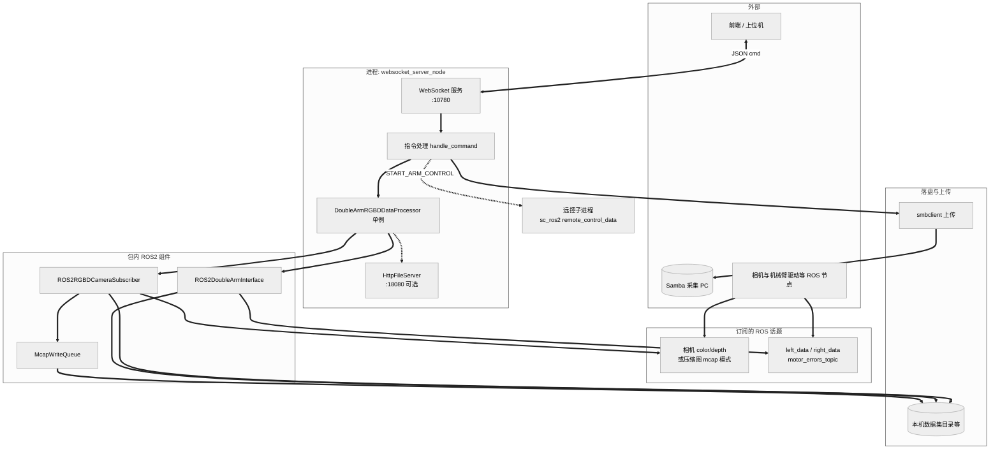

# 数采代码交接文档

本文档面向接手维护的同事，概述 web_test文件夹下 `src/`（及与之配套的 `include/`）所实现的**双臂数据采集系统**的软件架构、对外接口（ROS2/WebSocket等），以及编译与部署要点。

---

## 一、架构说明

下图概括本进程内模块分工及与外部交互；细节仍以源码为准。（下列 **Mermaid** 图在 GitHub / GitLab / VS Code / Cursor 等支持 Mermaid 的预览中可渲染。）

### 1.0 架构总览（示意图）



**读图要点**：上游页面通过 **WebSocket** 下发 `START_PREVIEW` / `START_TELEMETRY` 等指令；**DoubleArmRGBDDataProcessor** 协调相机订阅与双臂接口；可选 **Mcap** 经队列写 bag；需要时将数据经 **Samba** 推到采集 PC；**HttpFileServer** 仅在相关指令触发时启动，用于文件下载。

### 1.1 包定位

- **ROS 2 包名**：`my_dual_arm_package`（`ament_cmake`）。
- **功能**：双臂机器人**多模态数据采集**——订阅三路 RGBD 相机与双臂状态话题，按周期同步落盘（图像 + 关节数据），可选 **rosbag2/mcap** 压缩图录制；对外通过 **WebSocket** 供上层/前端控制预览、开始/结束采集、后处理与 Samba 上传等。
- **运行形态**：
  - **主路径（C++）**：`websocket_server_node` 可执行文件，内嵌 Boost.Beast WebSocket 服务，并持有 `DoubleArmRGBDDataProcessor` 单例协调采集。

### 1.2 源码分层与依赖关系

| 模块 | 职责 |
|------|------|
| **utils_config** | 相机话题映射 `ROS2_CAMERA_TOPIC_MAP`、机器人配置 `ROBOT_CONFIGS`、HDF5 结构创建、`meta_info`/相机参数、`3cameras.sh`/`CAMERA_SN_SCRIPT` 解析、全局 `ServerState` 等。 |
| **ros2_components** | `McapWriteQueue`（rosbag2 异步写队列）；`ROS2RGBDCameraSubscriber`（RGBD 订阅、预览 JPEG base64、落盘、`use_mcap` 时 CompressedImage）；`DoubleArmDataCache` + `ROS2DoubleArmInterface`（左右臂 `ArmData`、`MotorErrors`）。 |
| **data_collector** | `DoubleArmRGBDDataProcessor` **单例**：双执行器 spin、采集线程、`start_episode`/`end_episode`、H5 写入（可选）、mcap 模式切换等。 |
| **websocket_server_node** | WebSocket JSON 指令解析与业务编排；`/etc/orin_samba.conf`、`/etc/robot_config.json` 上报；可选拉起 **HttpFileServer**（文件下载）；`START_ARM_CONTROL` 时 fork 子进程跑 `sc_ros2 remote_control_data`。 |
| **http_file_server** | 基于 cpp-httplib 的静态文件服务，支持 Range，防路径穿越。 |

### 1.3 线程与执行器

- **相机节点**：`MultiThreadedExecutor` + 内部线程池（处理 color/depth、IO 写盘、JPEG 编码）。
- **机械臂节点**：`SingleThreadedExecutor`（避免与相机回调过度交织）。
- **采集**：独立 `record_thread` 按 `record_interval`（由相机 FPS 推导）调用 `_record_frame`。
- **Mcap**：`McapWriteQueue` 独立写线程，回调只入队 lambda，减轻回调栈压力。

### 1.4 数据流概要

1. **预览**：客户端发 `START_PREVIEW` → 单例以预览相机列表构造订阅 → 定时推送 `SEND_CAMERA_FRAME`（含 base64 JPEG）。
2. **采集**：目录初始化 → 相机 record 队列 + 机械臂缓存 → `end_episode` 合并写文本、可选 mcap bag。
3. **ROS 依赖话题**：见下文「ROS2 接口」。

---

## 二、接口定义文档

### 2.1 ROS2 订阅话题（相机）

配置表 `ROS2_CAMERA_TOPIC_MAP`（`utils_config.cpp`）中约定三路相机：`head`、`hand_left`、`hand_right`，每路包含：

| 逻辑键 | 典型话题（节选） |
|--------|------------------|
| `color` | 如 `/camera3/camera_head/color/image_raw` |
| `depth` | 如 `/camera3/camera_head/depth/image_rect_raw` |
| `color_compressed` / `depth_compressed` | `use_mcap:=true` 时用于 CompressedImage + rosbag2 |

**ROS 参数（在 `ROS2RGBDCameraSubscriber` 上声明）**：

- `save_depth`（bool）：是否保存深度图。
- `use_mcap`（bool）：是否走压缩话题并写入 bag 队列。

**CameraInfo** 拉取话题见 `CAM_INFO_TOPIC_MAP`（用于 `init_parameters` 写每相机 JSON）。

### 2.2 ROS2 订阅话题（机械臂）

| 话题名 | 消息类型 | 说明 |
|--------|-----------|------|
| `left_data` | `sc_ros2/msg/ArmData` | 左臂 16 维状态 |
| `right_data` | `sc_ros2/msg/ArmData` | 右臂 16 维状态 |
| `motor_errors_topic` | `sc_ros2/msg/MotorErrors` | 电机/虚拟墙/掉电等综合状态 |

**单臂 16 维语义**（与 `SINGLE_ARM_STATE_SPLIT` 一致）：7 关节 + 2 夹爪 + 3 末端位置 + 4 末端姿态。

> 当前编译链接的是 **sc_ros2**。

### 2.3 WebSocket 协议（JSON）

- **URL**：`ws://<本机第一个 eth* IPv4>:10780`（见 `main()`；无 eth 则回退逻辑以代码为准，常见为 `127.0.0.1`）。
- **请求格式**：JSON 对象，**必须含字符串字段 `cmd`**；可选 `mid`（消息 id，支持多种数字类型）、`data`（对象）。

**指令列表（`cmd`）**：

| cmd | 作用简述 |
|-----|----------|
| `GET_INFO` | 返回机型、协议版本、相机列表与 FPS 等 |
| `GET_AGENT_ID` | 设置 `agent_id`，写 Samba `robot_status.json` 周期性上报 |
| `GET_ROBOT_STATUS` | 电机状态 + 相机是否超时等 |
| `START_PREVIEW` | `data.camera_names` 指定预览相机 |
| `STOP_PREVIEW` | 停止预览推送 |
| `RECOVER` | 恢复/重置采集与单例（具体见实现） |
| `START_TELEMETRY` / `STOP_TELEMETRY` | 本地模式开始采集和结束采集，数据只保存在机器人上 |
| `STOP_AND_SUB` | 停止采集数据落盘到机器人上并通过samba传输到采集员电脑上 |
| `DATA_POSTPROCESS` | 数据后处理（临时目录 → 目标目录） |
| `DISCARD_DATA` / `DISCARD_BOTH_DATA` | 丢弃机器人上数据 | 丢弃机器人和采集员电脑两份数据
| `UPLOAD_TO_SAMBA` | 上传至 Samba（配置 `/etc/orin_samba.conf`） |
| `LIST_FILES` / `DELETE_ITEM` / `CLEAR_DIRECTORY` | 目录与文件管理 |
| `DOWNLOAD_FILE` | 可触发本机 **HttpFileServer**（默认端口 **18080**），返回下载 URL |
| `VERIFY_DATA` | 数据校验 |
| `WRITE_SUB_TASK_JSON` | 写子任务 JSON |
| `RECOLLECT_TASK` | 重采任务相关 |
| `CANCEL_COLLECTION` | 取消采集 |
| `START_ARM_CONTROL` / `STOP_ARM_CONTROL` | 启动/停止远控机械臂子进程 |

**响应惯例**：

- 成功：`{"cmd":"ACK","mid":...,"type":"...","data":{...}}`
- 失败：`{"cmd":"ERROR","mid":...,"data":{"code":500,"message":"..."}}`

**服务端主动推送**（示例）：`SEND_SAMPLER_PROCESS`、`SEND_CAMERA_FRAME`（见 `websocket_server_node.cpp` 内构建的 JSON）。

详细字段级约定建议对照 `websocket_server_node.cpp` 中 `handle_command` 与各分支中对 `data` 的读写。

### 2.4 HTTP 文件服务（可选）

- 类：`HttpFileServer`（`http_file_server.hpp`）。
- **默认**：端口 `18080`，根路径 **`/mnt/keenon_baidu_dataset`**；路由 `GET /files/(.*)`，带路径规范化防穿越；支持 `Range`。

### 2.5 磁盘与 HDF5 结构（可选，目前不用该格式保存机器人数据）

- **目录**：`init_task_directories` 创建 `record/raw_joints.h5`、`camera/<cam>/color|depth`、`parameters/...`、`meta_info.json` 等。
- **H5**：`create_h5_structure` 建立 `state`/`action` 下 `arm`、`end`、`effector`、`robot` 等可扩展数据集（详见 `utils_config.cpp`）。

### 2.6 环境变量与其它配置

| 项 | 作用 |
|----|------|
| `CAMERA_SN_SCRIPT` | 指向 `3cameras.sh`，用于解析分辨率/FPS/SN |
| `/etc/orin_samba.conf` | `SAMBA_HOST`、`SAMBA_SHARE`、`SAMBA_USER`、`SAMBA_PASS` |
| `/etc/robot_config.json` | `robotSn`、`tenantId`、`robotIp`/`url`、`aesKey`/`aesIv`、可选 `apiBaseUrl`，启动时可向云上报名采集端 URL |

---

## 三、编译与部署说明

### 3.1 依赖概要

来自 `package.xml` / `CMakeLists.txt`：

- **ROS 2**：`rclcpp`、`sensor_msgs`、`std_msgs`、`cv_bridge`、`sc_ros2`、`rosbag2_cpp`、`rosbag2_storage`。
- **系统/第三方**：OpenCV、HDF5（C/C++）、Boost（system/beast/asio/openssl 等）、OpenSSL、`nlohmann_json`。
- **可选运行时**：相机驱动相关包（`orbbec_camera`、`realsense2_camera` 等）。

需保证工作空间已能成功 `find_package(sc_ros2)`，且已 `source` 对应 `install/setup.bash`。

### 3.2 编译步骤

在 **ROS 2 工作空间**根目录（已包含本包）执行：

```bash
source /opt/ros/<distro>/setup.bash   # 如 humble
cd /path/to/workspace
colcon build --packages-select my_dual_arm_package
source install/setup.bash
```

### 3.3 运行

```bash
source install/setup.bash
ros2 run my_dual_arm_package websocket_server_node
```

启动后控制台会打印 WebSocket 监听地址（**`ws://<IP>:10780`**）。

运行前请确保：

- 相机与机械臂相关节点已按现场 launch 启动，话题名称与 `ROS2_CAMERA_TOPIC_MAP` 一致（或按需改源码/参数化）。
- 若使用 mcap/Samba/远控，检查 `use_mcap`、网络与 `/etc` 配置。

### 3.4 端口与防火墙

| 服务 | 端口 |
|------|------|
| WebSocket | **10780** |
| HTTP 文件下载（启用时） | **18080** |

部署时按需开放防火墙或做反向代理。

### 3.5 已知维护点

- **硬编码**：部分默认 SN、内参、Samba 默认账号在源码或 `utils_config.cpp` 中，生产环境建议改配置或外置。
- **安全**：`/etc` 密码、默认 AES 密钥、`DOWNLOAD_FILE` 暴露的文件根目录等需按公司规范管控。
---

## 四、文件索引（src/）

| 文件 | 说明 |
|------|------|
| `websocket_server_node.cpp` | WebSocket 服务入口、指令处理、Samba/上报/远控 |
| `data_collector.cpp` | `DoubleArmRGBDDataProcessor` 实现 |
| `ros2_components.cpp` | 相机与双臂 ROS 组件、`McapWriteQueue`、`base64_encode` |
| `utils_config.cpp` | 配置表、HDF5/meta、parameters、脚本解析 |

---

## 五、环境与部署清单（Orin / PC）

本节补充现场装机常用依赖、Samba、前端静态资源服务及一键脚本说明；与第三节「编译与部署」配合使用。

### 5.1 Orin（机器人端）：系统包与 ROS 依赖

```bash
sudo apt update
sudo apt install -y cifs-utils samba smbclient acl
sudo apt install ros-humble-librealsense2*
sudo apt install ros-humble-diagnostic-updater
sudo apt install ros-humble-rosbag2-storage-mcap
sudo apt install ros-humble-image-transport-plugins
sudo apt install nlohmann-json3-dev
sudo apt install moreutils
```

### 5.2 Orin：Node.js、wscat、http-server（静态页 / 联调用）

```bash
curl -fsSL https://deb.nodesource.com/setup_18.x | sudo -E bash -
sudo apt install -y nodejs
sudo npm install -g wscat
```

安装全局 `http-server`（若不想用系统全局目录，可用用户前缀避免权限问题）：

```bash
node -v   # 确认 Node.js 已就绪
mkdir -p ~/.npm-global
npm config set prefix '~/.npm-global'
echo 'export PATH="$HOME/.npm-global/bin:$PATH"' >> ~/.bashrc
source ~/.bashrc
npm install -g http-server
http-server -v
```

前端构建产物一般在工程下的 `dist/` 目录时，可在该目录用 `http-server` 起本地静态服务（具体以项目脚本为准）。

### 5.3 采集 PC：Samba 服务端

1. 安装：

```bash
sudo apt update
sudo apt install -y samba smbclient acl
```

2. 为 Samba 创建用户密码（将 `<linux用户名>` 替换为实际 Linux 登录用户，按提示设置 Samba 密码）：

```bash
sudo smbpasswd -a <linux用户名>
```

3. 编辑 `sudo vim /etc/samba/smb.conf`，在文件末尾增加共享（路径、用户名按现场修改）：

```ini
[data]
   path = /data
   browseable = yes
   writable = yes

   valid users = <linux用户名>
   force user = <linux用户名>
   force group = <linux用户名>

   create mask = 0664
   directory mask = 2775
```

4. 重启并设为开机自启，检查状态：

```bash
sudo systemctl restart smbd
sudo systemctl enable smbd
systemctl status smbd
```

5. **PC 上 `/data` 目录权限**（组与用户名按现场替换）：

```bash
sudo chown root:<linux用户名> /data
sudo chmod 2775 /data
sudo setfacl -R -m g::rwx /data    # 修复已有目录
sudo setfacl -d -m g::rwx /data    # 默认 ACL，新文件/目录继承
```

更完整的自动化可参考仓库根目录 `setup_samba.sh`（路径以实际 checkout 为准）。

### 5.4 Orin：`/etc/orin_samba.conf`（连接采集 PC）

每台 Orin 对应一台采集 PC；在 Orin 上创建 `/etc/orin_samba.conf`，内容示例（**IP、账号、密码按现场填写**，勿提交真实口令到版本库）：

```ini
SAMBA_HOST=192.168.xx.xx #请根据实际ip
SAMBA_SHARE=data
SAMBA_USER=<用户名>
SAMBA_PASS=<密码>
```

程序会读取该文件用于 `smbclient` 上传等（与代码中默认值的优先级以实现为准）。

### 5.5 一键启动与常用脚本（仓库根目录，路径按部署机器调整）

| 脚本 / 文件 | 说明 |
|-------------|------|
| `start_service.sh` | 一键启动 http-server、相机驱动与后端等（以脚本内命令为准）。 |
| `run_cpp.sh` | 启动相机与 WebSocket 后端；可在其中配置是否 **mcap 录制**、是否 **保存深度图** 等参数。 |
| `3cameras.sh` | 修改相机 **分辨率、帧率** 等（与 `CAMERA_SN_SCRIPT` / 环境变量配合）。 |

机械臂遥操（与 WebSocket 指令 `START_ARM_CONTROL` / `STOP_ARM_CONTROL` 等价）可在工作空间终端手动执行：

```bash
cd /home/sc_ros   # 按现场实际路径，例如 ~/sc_ros
taskset -c 0,1 ros2 run sc_ros2 remote_control_data
```

亦可通过前端/WebSocket 发送指令由 `websocket_server_node` 拉起上述进程（详见第二节指令表）。